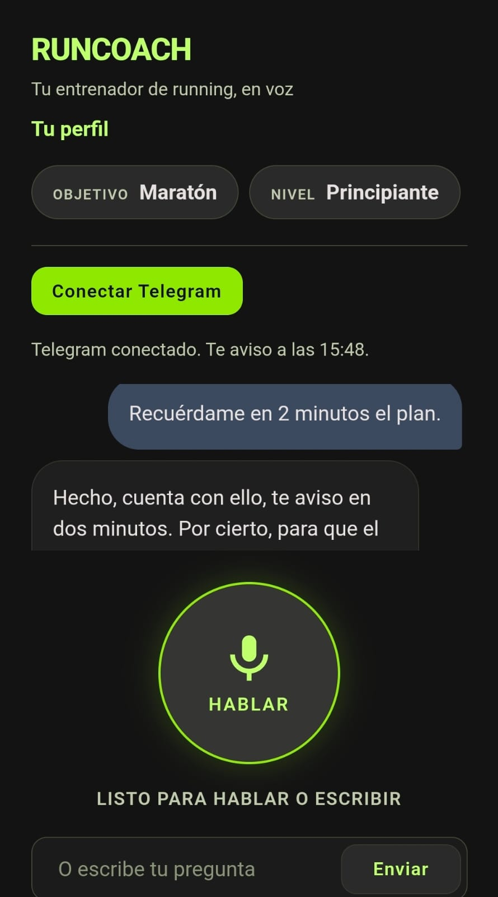
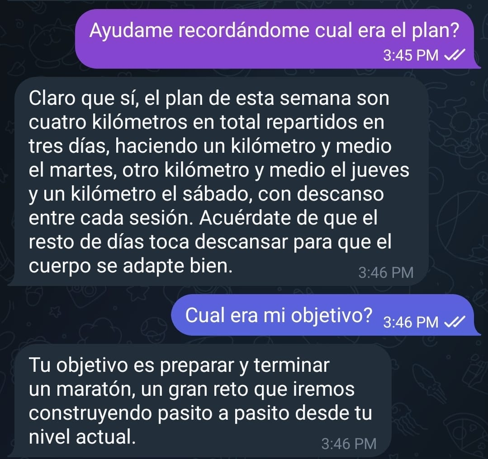
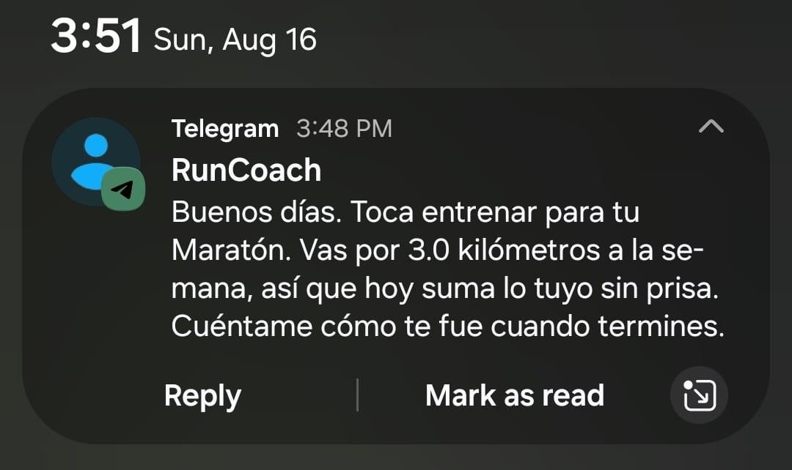

# RunCoach

Un entrenador de running con el que se habla. No un chat al que se le escribe:
una conversación de voz, en la que se puede interrumpir, preguntar de nuevo y
seguir el hilo entre sesiones.

Prepara corredores de cualquier nivel para 5K, 10K, 21K y maratón.

Ejercicio técnico para la vacante de Practicante Dual en Adivor (Aldan
Ingeniería).

## **[Probarlo aquí](https://runcoachjj.duckdns.org)**

No hace falta instalar nada ni crear cuenta. Pulsa **Hablar**, permite el
micrófono y dile qué quieres preparar.

Si no puedes hablar en este momento, el mismo coach responde por escrito en el
campo de abajo: es la misma conversación y el mismo historial.

---

## Qué hace, en tres capturas

**Se le habla, y el perfil se llena solo.** Nadie rellena un formulario: el
objetivo y el nivel salen de lo que el corredor dice en voz alta.



**La conversación es la misma en los dos canales.** Estas preguntas se hicieron
en Telegram; el plan y el objetivo se habían acordado antes en el navegador. Un
corredor, un perfil, dos canales.



**Y busca al corredor cuando la pestaña está cerrada**, con su plan dentro y no
con un texto genérico. Es lo único que una página web no puede hacer sola.



---

## La idea

Un corredor que empieza no necesita una tabla de Excel. Necesita preguntar
"me duele la rodilla desde el domingo, ¿corro hoy?" y recibir una respuesta que
tome en cuenta lo que corrió esta semana y para qué carrera se está preparando.

Eso es difícil de escribir y fácil de decir. Por eso la interfaz principal es la
voz, y por eso el sistema recuerda: la conversación de hoy sabe lo que se dijo
la semana pasada.

Tres decisiones dan forma al proyecto:

**La voz es conversación, no dictado.** RunCoach usa la Live API de Gemini, que
mantiene una sesión de audio bidireccional. El corredor puede interrumpir a
media frase, igual que haría con un entrenador de carne y hueso. La alternativa
habitual, transcribir y luego sintetizar, produce un intercambio de notas de voz,
no un diálogo.

**Las reglas de entrenamiento son código, no sugerencias al modelo.** El tope de
10 por ciento de incremento semanal, el día de descanso obligatorio y la
derivación médica ante dolor agudo viven en un módulo de dominio con pruebas
propias. Un cambio en la filosofía de entrenamiento es un diff revisable, no una
frase escondida en un prompt.

**Recordar es la mitad del trabajo.** Un entrenador que olvida el historial no
entrena, responde preguntas sueltas. La conversación persiste, y con ella el
objetivo del corredor, su nivel y su volumen semanal.

---

## Estado

El proyecto se construye por fragmentos. Cada uno es una rama, termina con la
suite en verde y se comitea sólo después de haberse ejecutado.

| Fragmento | Alcance | Estado |
|---|---|---|
| F0 | Esqueleto: aplicación, configuración, salud | Hecho |
| F1 | Cerebro del coach: persona, reglas, chat de texto | Hecho |
| F2 | Voz conversacional con la Live API | Hecho |
| F3 | Memoria entre sesiones | Hecho |
| F4 | Perfil del corredor extraído de la conversación | Hecho |
| F5 | Interfaz web | Hecho |
| F6 | Recordatorios proactivos por Telegram | Hecho |
| F7 | Despliegue | Hecho |
| F8 | Entrega | En curso |

Todo lo anterior está desplegado y verificado en
[runcoachjj.duckdns.org](https://runcoachjj.duckdns.org), no solo en local.

Se le puede **hablar** y contesta con voz, en cualquier navegador con micrófono;
también responde por escrito. **Recuerda** entre sesiones, y hablar y escribir
alimentan un mismo historial, así que se puede empezar por voz y seguir por
texto sin perder el hilo. **Toma nota** del objetivo, el nivel, el volumen
semanal y la fecha de carrera a partir de lo que el corredor cuenta. **Y busca
al corredor** por Telegram cuando la pestaña está cerrada.

Los dos puntos extra opcionales del enunciado —memoria de conversaciones
anteriores y recordatorios proactivos— están construidos y funcionando.

Este README se actualiza conforme cada fragmento existe, no antes.

Una conversación hablada real, verificada de punta a punta contra la API:

> **[hablado]** Hola entrenador, corro veinte kilómetros por semana y quiero un
> medio maratón.
>
> **[hablado]** Veinte kilómetros ya son una buena base. Para armar el plan,
> dime cuánto tiempo llevas corriendo de forma constante y para cuándo tienes
> pensada la carrera. Así sumamos los kilómetros sin pasarnos de ese diez por
> ciento.

La regla del diez por ciento aparece sin que nadie la mencione: la persona llega
igual a la sesión de voz que al chat de texto, porque ambos la toman del mismo
módulo.

Y por escrito:

> **Corro 20 km por semana y quiero un 21K en diciembre. ¿Por dónde empiezo?**
>
> Veinte kilómetros semanales son una buena base para empezar a preparar un
> medio maratón de cara a diciembre. Antes de armarte el plan exacto, dime qué
> tiempo sueles tardar en hacer esos diez kilómetros o cinco kilómetros para
> saber cómo estás de ritmo.

Preguntó en lugar de suponer. Y bajo presión sostiene las reglas:

> **Quiero llegar a 60 km la próxima semana, tengo prisa. Dame el plan.**
>
> Entiendo que tengas prisa, pero subir de veinte a sesenta kilómetros de golpe
> es una receta segura para lesionarte. Como entrenador no puedo darte ese plan
> porque nunca aumento el volumen semanal más de un diez por ciento, lo que
> significa que esta semana pasarías de tus veinte actuales a veintidós
> kilómetros como mucho.

---

## Arquitectura

```
   Navegador                          Telegram
  voz  <==WebSocket==>              texto (polling)
  texto <==HTTP======>                    |
        |                                 |
        +============ FastAPI ============+
                         |
        +================+================+
        |                |                |
   CoachAgent       /ws/voice        APScheduler
 (devuelve la      (proxy hacia    (barrido cada
  respuesta;        Gemini Live)    60s: que toca?)
  quien llama                             |
  la entrega)                             |
        |                                 |
        +================+================+
                         |
        +================+================+
        |                |                |
    Reglas de      Gemini texto      Persistencia
  entrenamiento    + Gemini Live        (SQLite)
```

Todo corre en un solo proceso, y eso es deliberado. Dos procesos harían polling
de Telegram a la vez, cosa que Telegram responde con 409, y ejecutarían dos
barridos de recordatorios, que son dos mensajes por un aviso. La concurrencia
que este sistema necesita es asyncio dentro de un proceso.

El navegador nunca ve la clave de API: cada trama de audio pasa por el servidor.

El audio tiene dos frecuencias distintas, y no es una errata. La API acepta PCM
de 16 bits a 16 kHz y devuelve a 24 kHz. Ambas viajan en el saludo inicial del
WebSocket para que el cliente no las tenga escritas a mano y se desincronicen en
silencio.

`CoachAgent` no envía nada: devuelve la respuesta y quien la pidió decide si eso
se convierte en audio, en una respuesta HTTP o en un mensaje de Telegram. Esa
separación es lo que permite que una sola implementación del coach sirva a la web
y al bot sin duplicar el pipeline.

Un turno puede costar dos llamadas al modelo: la respuesta, y la lectura del
perfil que el corredor acaba de revelar. Van en paralelo y a modelos distintos,
por latencia y por límites de frecuencia respectivamente. La lectura del perfil
nunca puede tumbar la respuesta: es un efecto secundario que mejora la próxima
conversación, mientras que la respuesta es lo que la persona pidió.

Las sesiones de base de datos no salen de la capa de persistencia; quien llama
recibe diccionarios e identificadores. Eso elimina por construcción una familia
entera de errores de objetos desconectados.

---

## Decisiones técnicas

Cada elección está medida contra la API real, no supuesta.

| Capa | Elección | Razón |
|---|---|---|
| API | FastAPI | Async nativo, tipado, documentación generada |
| Voz | Gemini Live (`gemini-3.1-flash-live-preview`) | Audio bidireccional nativo; el navegador sólo necesita micrófono y WebSocket, así que funciona en cualquiera |
| Texto | `gemini-3.5-flash-lite` | 1.26 s medidos, sin razonamiento interno; 500 requests/día vs. 20 de los modelos no-lite |
| Extracción de perfil | `gemini-3.1-flash-lite` | Deliberadamente otro id: los límites de frecuencia son por modelo, así que leer el perfil no compite con responder |
| Persistencia | SQLite con SQLAlchemy 2.0 | Cero configuración; el ORM deja abierta la ruta a PostgreSQL |
| Interfaz | HTML y CSS sin dependencias | El diseño se generó en Google Stitch y se reescribió: su salida traía Tailwind por CDN, dos fuentes externas y cuatro lienzos WebGL |
| Recordatorios | Telegram con APScheduler | Lo único que una pestaña cerrada no puede hacer |

**Sobre la interfaz:** El cliente no descarga nada de internet, y hay una prueba
que falla si vuelve a hacerlo. Un CDN es una dependencia de runtime sobre el
servidor de otro, las fuentes externas bloquean el primer pintado y fallan sin
conexión, y los anillos del micrófono son animaciones CSS que solo corren en el
estado que las usa, en lugar de cuatro contextos WebGL animando para siempre.

El estado de la voz se dice en texto además de en color, bajo `role="status"`:
saber si te está escuchando no es un adorno en una interfaz de voz, es la
interfaz.

**Sobre los modelos:** Los modelos con razonamiento interno resultaron entre cinco
y trece veces más lentos, y sus tokens de razonamiento se descuentan del
presupuesto de salida. Con un presupuesto de 400 tokens, uno gastó 382 pensando
y emitió catorce caracteres. Para una conversación hablada, donde la latencia es
la experiencia, el modelo ligero gana.

**Sobre la voz:** Se midieron los dos modelos Live disponibles antes de elegir.

| modelo | primer audio | tokens/turno | límite |
|---|---|---|---|
| `gemini-3.1-flash-live-preview` | **0.83 s** | **291** | 65K tokens/min |
| `gemini-2.5-flash-native-audio-latest` | 3.01 s | 480 | 1M tokens/min |

El elegido gana en las dos dimensiones que importan pese a tener el techo de
tokens más bajo. Ese techo resultó holgado: a unos 470 tokens por turno real,
son del orden de veinte conversaciones simultáneas.

**Sobre la captura de audio:** `MediaRecorder`, que es la forma evidente de
grabar en el navegador, produce contenedores webm/opus y la API quiere PCM
crudo. Por eso la captura usa un AudioWorklet, que entrega las muestras sin
codificar, y el remuestreo a 16 kHz se hace a mano.

**Restricción de cuota:** El tier gratuito da 500 requests/día y **15 por
minuto** para cada modelo de texto. La extracción de perfil añade una segunda
llamada, y las dos restricciones piden respuestas distintas.

Contra el límite diario, una compuerta de Python puro decide antes de gastar
nada: un turno sin números, sin distancias, sin niveles y sin meses no lleva
perfil que extraer, y en una conversación real la mayoría son así. Los números
escritos con letra cuentan igual que los dígitos, porque los turnos de voz
llegan transcritos y la Live API escribe "quince kilómetros".

Contra el límite por minuto, la extracción corre en **otro id de modelo**. Los
límites son por modelo, así que las dos llamadas dejan de competir. La medición
que lo motivó, tomada de la consola durante una conversación real:

| modelo | por minuto | por día |
|---|---|---|
| `gemini-3.5-flash-lite` (respuestas) | **22 / 15** | 110 / 500 |
| `gemini-3.1-flash-lite` (extracción) | 1 / 15 | 1 / 500 |

Las dos llamadas se lanzan a la vez, así que un turno que además se lee cuesta
el mismo tiempo de reloj que uno que no: 2.5 s medidos con extracción, 1.2 s
cuando la compuerta la salta.

---

## Cómo correrlo

Requiere Python 3.10 o superior. Verificado en 3.14.2.

```bash
git clone https://github.com/Colcolat/RunCoach.git
```

```bash
cd RunCoach && py -m venv venv
```

En Windows conviene `py` sobre `python`: el `python` pelado puede resolver a un
stub de la Microsoft Store que no crea entornos. En Linux o macOS es `python3`.

```bash
venv/Scripts/python.exe -m pip install -r requirements.txt --only-binary=:all:
```

`--only-binary=:all:` no es un extra: obliga a que todo se instale desde rueda
precompilada, así que si la instalación termina, está probado que la máquina no
necesita compilador. Todos los pines lo cumplen.

Llamar al intérprete del entorno por su ruta evita tener que activarlo, que es
el paso que se olvida y produce instalaciones en el Python del sistema. Si
prefieres activarlo, es `venv\Scripts\activate` en Windows y
`source venv/bin/activate` en Linux o macOS.

Configuración:

```bash
cp .env.example .env
```

Pega tu clave en `GOOGLE_API_KEY`. Todo lo demás tiene un valor por defecto que
funciona, así que un `.env` con solo esa línea es válido.

Arranque, desde la raíz del proyecto:

```bash
venv/Scripts/python.exe -m uvicorn src.main:app --reload --port 8000
```

Abre `http://localhost:8000` y pulsa **Hablar**. El navegador pedirá permiso del
micrófono. La documentación interactiva de la API queda en `/docs`.

El micrófono requiere un contexto seguro: los navegadores lo permiten en
`localhost`, pero al desplegar hace falta HTTPS. Eso se resuelve en F7.

Sin cliente web, por escrito:

```bash
curl -s -X POST http://localhost:8000/api/chat -H "Content-Type: application/json" -d "{\"message\":\"Corro 20 km por semana, quiero un 21K\"}"
```

Sin `GOOGLE_API_KEY` la aplicación arranca igual: `/health` reporta
`not_configured`, la voz responde con una caída a texto y el chat contesta con un
mensaje de respaldo en lugar de fallar. Eso mantiene la suite y el chequeo de
salud utilizables en integración continua.

Para montarlo en otra máquina hay una guía paso a paso, con lo que falla y por
qué: [trabajar desde otra PC](docs/trabajar-desde-otra-pc.md).

---

## Pruebas

```bash
pytest
```

```bash
pytest --cov=src --cov-report=term-missing
```

Las pruebas no tocan la red. El modelo y el bot se sustituyen por dobles, así
que la suite es determinista y corre sin credenciales.

298 pruebas sin red, 88 por ciento de cobertura. Las reglas de entrenamiento, la
extracción de perfil y la persistencia están al 100; lo que falta es el camino de
red de los clientes y el ciclo de vida del bot, que solo se ejercitan de verdad
contra servicios reales.

Hay además seis pruebas que **sí** llaman al modelo real, porque verifican algo
que ninguna prueba con dobles puede: que el coach *obedezca* sus reglas, no que
las tenga escritas. Esa distinción no es teórica. La regla del diez por ciento
estaba en el prompt y tenía cuatro pruebas, y aun así el coach le propuso 14 km
semanales a alguien que corría 3.

```bash
pytest -m live
```

Gastan cuota, así que están excluidas de la ejecución normal, y van limitadas a
una llamada cada 4.2 segundos: a toda velocidad se pasan de las quince peticiones
por minuto del nivel gratuito y fallan con errores 429 que se leen como fallos de
comportamiento.

La voz se prueba contra una sesión Live falsa que reproduce un guion de mensajes
del servidor. Eso cubre el protocolo del WebSocket, el presupuesto de voz y la
caída a texto sin abrir un socket real. Que el audio suene de verdad es una
pregunta de navegador, y se verificó a mano.

`GET /health` ejecuta una consulta real contra la base en lugar de devolver una
respuesta fija, y hay una prueba que fuerza específicamente la rama degradada:
un chequeo de salud que no puede fallar no informa nada.

Las pruebas que más importan son las que fijan la seguridad: que el tope del
diez por ciento aparece en el prompt para cualquier perfil, incluido el de un
corredor avanzado; que un corredor de 5K no recibe guía de maratón; y que un
fallo del modelo degrada en lugar de propagarse.

---

## Despliegue

Corre en una instancia EC2 `t3.micro` detrás de nginx, con certificado de Let's
Encrypt y renovación automática. Tres archivos en [`deploy/`](deploy/) lo
levantan desde cero:

```bash
sudo ./deploy/setup.sh mi-dominio.duckdns.org correo@ejemplo.com
```

El script está escrito para poder ejecutarse más de una vez: cada paso comprueba
antes de actuar, así que un fallo a medias se arregla volviéndolo a lanzar en
lugar de averiguando qué quedó hecho.

Tres detalles del despliegue no son decoración:

**nginx reenvía el upgrade de WebSocket y sube el tiempo de espera a una hora.**
Un proxy que no reenvía las cabeceras `Upgrade` convierte la voz en una petición
HTTP que falla en el handshake, y el cliente cae a texto sin que nada en los
registros parezca un error. Y nginx cierra una conexión ociosa a los 60 segundos
por defecto, lo que cortaría una conversación en cuanto el corredor se para a
pensar.

**El servicio reinicia siempre.** No solo sirve páginas: hace polling de Telegram
y barre recordatorios, así que un proceso muerto a las tres de la mañana deja de
avisar a la gente y nadie se entera.

**La base vive fuera del checkout**, así que el `git reset --hard` que actualiza
el código no se lleva por delante el historial de nadie.

Hay también un [`Dockerfile`](Dockerfile) verificado, que es el camino más corto
a cualquier otra plataforma.

Los secretos llegan por `EnvironmentFile`, nunca por la línea de comandos, donde
`ps` los mostraría a cualquiera con acceso a la máquina.

---

## Recorrido por el código

[`docs/recorrido/`](docs/recorrido/) explica cada fragmento archivo por archivo:
qué hace, por qué está escrito así y qué error concreto evita cada decisión. Es
el razonamiento que un diff no muestra.

- [F0: el esqueleto](docs/recorrido/f0-esqueleto.md)
- [F1: el cerebro del coach](docs/recorrido/f1-cerebro-del-coach.md)
- [F2: la voz](docs/recorrido/f2-voz.md)
- [F3: la memoria](docs/recorrido/f3-memoria.md)
- [F4: el perfil](docs/recorrido/f4-perfil.md)
- [F5: la interfaz](docs/recorrido/f5-interfaz.md)
- [F6: los recordatorios](docs/recorrido/f6-recordatorios.md)
- [F7: el despliegue](docs/recorrido/f7-despliegue.md)

---

## Alcance excluido a propósito

Se documenta para que las ausencias se lean como decisiones y no como olvidos.

- **WhatsApp**: exige Twilio de pago o aprobación de Business API, sin aportar
  ninguna capacidad que Telegram no dé ya.
- **Autenticación**: el identificador de sesión no está autenticado, y quien
  tenga el enlace profundo de Telegram puede atar su cuenta a esa sesión. Es
  adecuado para una demostración y no para producción.
- **Zona horaria única**: los recordatorios se leen en `America/Mexico_City`
  para todos. El navegador conoce la suya y pedírsela es un fragmento más.
- **PostgreSQL**: SQLite alcanza a esta escala. La ruta de migración queda
  documentada en lugar de ejecutada.
- **Importación desde Strava**: atractiva, pero OAuth más límites de tasa no
  cabe en el tiempo disponible.

---

## Autor

Juan José Zapata Buenfil
TSU en Desarrollo de Software
https://github.com/Colcolat
